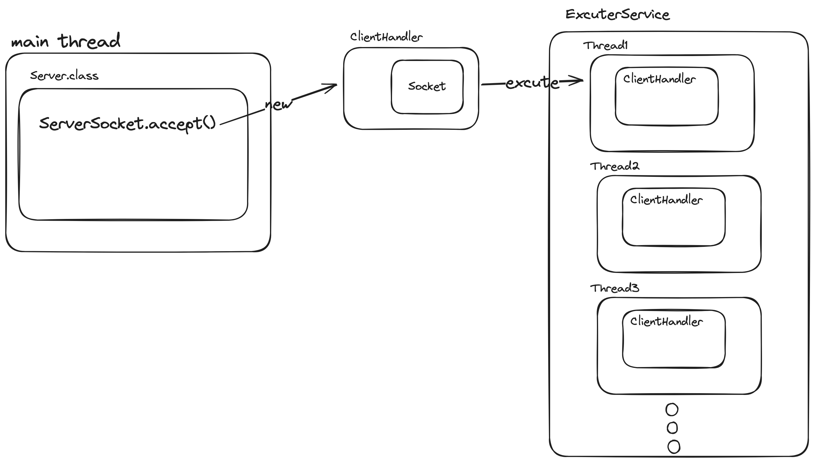
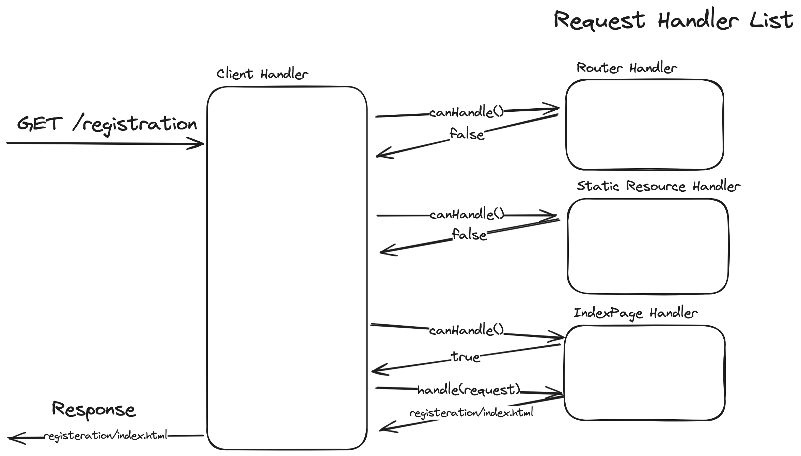
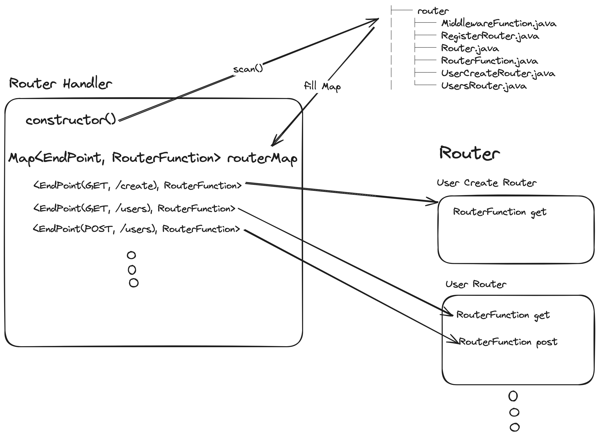

# Java WAS

2024 우아한 테크캠프 프로젝트 WAS

<!-- TOC -->
* [Java WAS](#java-was)
  * [멀티스레드](#멀티스레드)
  * [HTTP Request](#http-request)
  * [Request Handler](#request-handler)
  * [Router](#router)
  * [Json Body Response](#json-body-response)
  * [Endpoint](#endpoint)
<!-- TOC -->

## 멀티스레드
- main thread에서 `serverSocket.accept()` 
- 생성된 Socket으로 `Runnable` class `ClientHandler` 생성
- `ExcuterService` 를 통해서 멀티 스레드로 요청처리가 가능하게 구현



## HTTP Request
- rfc 규격에 맞게 HTTP 요청을 파싱할 수 있도록함
- `start-line   = method SP request-target SP HTTP-version CRLF`  의 request-target 의 종류에 따라 URI 객체를 생성

## Request Handler
- 요청 처리 핸들러 생성
```java
public interface RequestHandler {  

    boolean canHandle(Endpoint endPoint);  
  
    HttpResponse handle(HttpRequest request) throws Exception;  
}
```
- 각 핸들러는 처리 가능여부를 반환하는 `canHandle()` 메서드와 요청을 처리하는 `handle()` 메서드 구현
- Request Handler List를 순회하며 처리 가능한 `handler`에서 요청 처리
- List 순서에 따라 요청 처리 우선순위를 지정할 수 있음




## Router
- Http 요청을 처리하는건, 어떤 리소스에 어떤 메서드로 요청을 했냐에 따라 요청 처리가 달라진다고 생각
- 따라서, Http Method와 리소스를 나타내는 `EndPoint` 객체를 추가
```java
public record EndPoint(HttpMethod method, String path) {}
```
- `EndPoint`를 키로 하는 Router Map 구현
- 요청을 처리하기 위하기 위한 함수 `RouterFunction` 지정
```java
@FunctionalInterface  
public interface RouterFunction {  
    Object route(HttpRequest request, HttpResponse response);  
}
```
- 각 요청에 맞는 `RouterFunction` 을 매핑
 


## Json Body Response
- 라이브러리 사용을 지양해서 Json을 직접 해결해야했음
- Json 형식으로 응답을 보내기 위해 `JsonConverter` 인터페이스 생성
```java
public interface JsonConverter {  
    byte[] convertToJsonBytes(Object obj) throws Exception;  
}
```
- `record` class와 `Map<K,V>` 인터페이스의 구현체를 Json형식으로 변환하는 구현체 생성
- `src/main/java/codesquad/util/jsonconverter/MapJsonConverter.java`
- `src/main/java/codesquad/util/jsonconverter/RecordJsonConverter.java`

## Endpoint
- path가 정확히 일치하지 않고 pathvariable에 따라 다른 요청 path도 처리할 수 있어야함
- match 메서드 구현
- 아래와 같이 pathvariable이 match함
- `src/test/java/codesquad/util/EndPointTest.java`
```java
@Test  
public void testPathVariableMatch() {  
    EndPoint endPoint = EndPoint.of(HttpMethod.GET, "/users/{id}");  
    assertTrue(endPoint.matches("GET", "/users/123"));  
}
```
- 이 메서드를 `equals`  메서드에도 적용해서 Map의 키로 매칭 가능하게 해야할지 고민