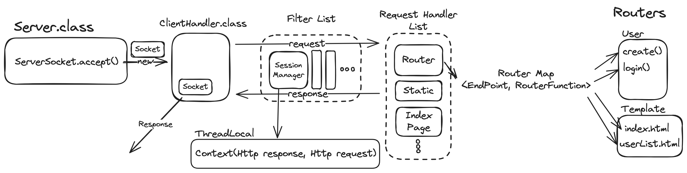

# Java WAS

2024 우아한 테크캠프 프로젝트 WAS

start
```bash
./gradlew run
```
[localhost:8080/index.html](http://localhost:8080/)

<!-- TOC -->
* [Java WAS](#java-was)
* [Week 2](#week-2)
  * [Filter 도입](#filter-도입)
  * [Context](#context)
  * [SessionManager](#sessionmanager)
  * [Factory](#factory)
  * [Configurable 한 Router 만들기](#configurable-한-router-만들기)
  * [Configuration](#configuration)
* [Week 1](#week-1)
  * [멀티스레드](#멀티스레드)
  * [HTTP Request](#http-request)
  * [Request Handler](#request-handler)
  * [Router](#router)
  * [Json Body Response](#json-body-response)
  * [Endpoint](#endpoint)
<!-- TOC -->
# Week 2



## Template 만들기
- `String.format()`을 사용하여 간단한 템플릿 엔진을 만들었습니다.
- /template 디렉터리 아래에 html 파일을 만들어 놓고, 해당 파일을 읽어와서 `String.format()`을 사용하여 동적으로 html을 생성합니다.

nameBtn.html
```html
<li class="header__menu__item">
    <a class="btn btn_contained btn_size_s" href="/login">%s 님</a>
</li>
```

필요한 값을 동적으로 채우기
```java
String.format(nameBtn.html, user.name);
```

## Filter 도입
- `Filter` 인터페이스를 도입하여 요청 전후 처리를 할 수 있도록 하였습니다
```java
public interface Filter {
    void before(HttpRequest request, HttpResponse response);
    void after(HttpRequest request, HttpResponse response);
}
```

## Context
하나의 요청의 Context를 저장하기 위해 `ThreadLocal`을 사용했습니다.

각 요청별로 하나의 Thread를 사용하기 때문에 `ThreadLocal`을 사용하면 각 요청의 Context를 저장할 수 있습니다.
Context로는 'HttpRequest', 'HttpResponse'를 저장했습니다.

## SessionManager
Session을 관리하기 위한 SessionManager class를 만들었습니다.
Session Manager는 'ThreadLocal'을 사용하여 각 요청의 Session을 저장합니다.
Filter를 통해 Session을 생성하고, Session을 저장하고, Session을 삭제하는 역할을 합니다.

## Factory
메서드가 singleton 객체를 생성하고, 생성된 객체를 저장하고, 저장된 객체를 반환하는 역할을 하는 Factory class를 만들었습니다.

`getOrComputeBean()` 메서드는 singleton을 보장해 줍니다.
```java
public class ServerBeanFactory {
    private final Map<Class<?>, Object> beanMap = new HashMap<>();

    public Server server() {
        return getOrComputeBean(Server.class, () -> new Server(configuration()));
    }

    public Configuration configuration() {
        return getOrComputeBean(Configuration.class, () -> new ServerConfiguration(this).init());
    }

    public UsersRouter usersRouter() {
        return getOrComputeBean(UsersRouter.class, () -> (UsersRouter) new UsersRouter(sessionManager(), userDao()).init());
    }

    public UserDao userDao() {
      return getOrComputeBean(UserDao.class, UserDao::new);
    }

  // 추가 class ...

    protected synchronized <T> T getOrComputeBean(Class<T> beanClass, Supplier<T> supplier) {
        Object o = beanMap.get(beanClass);
        if (o == null) {
            T t = supplier.get();
            beanMap.put(beanClass, t);
            o = t;
        }
        return beanClass.cast(o);
    }
}
```

## Configurable 한 Router 만들기

- Router를 만들기 위해서는 `Router` class를 상속받아서 구현합니다.
- 이때, 상속받은 Router class에서는 Rouuter 동작을 수행할 RouterFunction을 만듭니다.
- 만든 RouterFunction은 `addRouterFunctions()` 메서드를 상속받아 매핑 정보를 추가하기만 하면 됩니다.

```java
public class UsersRouter extends Router {
    private final UserDao userDao;
    public UsersRouter(UserDao userDao) {this.userDao = userDao;}

    @Override
    protected String setBasePath() {
        return "/users";
    }
    
    @Override
    protected void addRouterFunctions(PairAdder<EndPoint, RouterFunction> routerFunctionAdder) {
        routerFunctionAdder.add(getUsersEndPoint, this::getUsers);
    }

    private final EndPoint getUsersEndPoint = EndPoint.of(HttpMethod.GET, "/users");
    private List<User> getUsers(HttpRequest request, HttpResponse response) {
        return userDao.findAll();
    }
}
```

- `addRouterFunctions()` 메서드의 매개변수 `PairAdder`는 Functional Interface로 다음과 같이 정의되어 있습니다.
```java
@FunctionalInterface
public interface PairAdder<K, V> {
    void add(K k, V v);
}
```
- `add()` 메서드를 하나만 구현하게 되어 있고, 이에대한 구현체는 상위 `Router` class에서 구현되어 있습니다.

Router.java
```java
public abstract class Router {
    private final String basePath;
    private Map<EndPoint, RouterFunction> routerFunctionMap = new HashMap<>();

    public Router() {
        basePath = setBasePath();
        addRouterFunctions(this::routerFunctionAdder);
    }

    protected String setBasePath() {return "";}

    public final String getBasePath() {
        return basePath;
    }

    protected void addRouterFunctions(PairAdder<EndPoint, RouterFunction> routerFunctionAdder) {}

    private void routerFunctionAdder(EndPoint endPoint, RouterFunction routerFunction) {
        EndPoint endPointWithBasePath = EndPoint.of(endPoint.method(), basePath + endPoint.path());
        routerFunctionMap.put(endPointWithBasePath, routerFunction);
    }
}
```
- 객체가 생성될때 `addRouterFunctions()` 메서드를 호출하게 되어 있습니다.
- `addRouterFunctions()` 메서드는 `PairAdder`를 매개변수로 받아서 `routerFunctionAdder()` 메서드를 호출합니다.
- 따라서, `Router`를 상속받아 구현할때 `addRouterFunctions()` 메서드를 통해서 `routerFunctionAdder.add()` 메서드를 호출하면 됩니다.
- `routerFunctionAdder.add()` 메서드는 `EndPoint`와 `RouterFunction`을 매핑합니다.

- `basePath`도 `setBasePath()` 메서드를 통해서 설정할 수 있습니다.

## Configuration

- `Server` 에서 사용할 `Configuration`을 만드려면 `Configuration` class를 상속받아 구현하면 됩니다.
- `Configuration` class에서는 `addRequestHandlers()`, `addRouterFunctions()`, `addRouters()` 메서드를 구현하면 됩니다.
  - `addRequestHandlers()` 메서드는 `Server`에서 사용할 `RequestHandler`를 추가합니다.
  - `addRouterFunctions()` 메서드는 `Router`에서 사용할 `RouterFunction`을 추가합니다.
  - `addRouters()` 메서드는 `Router`를 추가합니다.

ServerConfiguration.java
```java
public class ServerConfiguration extends Configuration {
    
    @Override
    protected void addRequestHandlers(Adder<RequestHandler> requestHandlerAdder) {
        requestHandlerAdder.add(new StaticResourceHandler());
        requestHandlerAdder.add(new IndexPageHandler());
    }

    @Override
    protected void addRouterFunctions(PairAdder<EndPoint, RouterFunction> routerFunctionAdder) {
        routerFunctionAdder.add(EndPoint.of(HttpMethod.GET, "/luizy"), (request, response) -> "Hello, Luizy!");
    }

    @Override
    protected void addRouters(Adder<Router> routerAdder) {
        routerAdder.add(new UsersRouter(UserDao.getInstance()));
        routerAdder.add(new RegisterRouter());
    }
}
```
- `addRequestHandlers()`, `addRouters()`의 매개변수는 Functional Interface로 다음과 같이 정의되어 있습니다.
```java
@FunctionalInterface
public interface Adder<T> {
    void add(T t);
}
```

- `addRequestHandlers()`, `addRouterFunctions()`, `addRouters()` 메게변수의 구현체는 상위 `Configuration` class에서 구현되어 있습니다.

Configuration.java
```java
public abstract class Configuration {
    private List<RequestHandler> requestHandlers = new ArrayList<>();
    private Map<EndPoint, RouterFunction> routerFunctionMap = new HashMap<>();

    public Configuration() {
        // setRouterFunctionMap
        addRouterFunctions(this::routerFunctionAdder);
        // setRouters
        addRouters(this::routerAdder);
        // setRequestHandlers
        addRequestHandlers(this::requestHandlerAdder);
    }
    
    protected void addRequestHandlers(Adder<RequestHandler> requestHandlerAdder) {}
    private void requestHandlerAdder(RequestHandler requestHandler) {
        requestHandlers.add(requestHandler);
    };
    
    protected void addRouterFunctions(PairAdder<EndPoint, RouterFunction> routerFunctionAdder) {}
    private void routerFunctionAdder(EndPoint endPoint, RouterFunction routerFunction) {
        routerFunctionMap.put(endPoint, routerFunction);
    };

    protected void addRouters(Adder<Router> routerAdder) {}
    private void routerAdder(Router router) {
        router.getRouterFunctionMap().forEach((endPoint, routerFunction) -> {
            routerFunctionMap.put(endPoint, routerFunction);
        });
    };
}
```
- 객체가 생성될때 `addRequestHandlers()`, `addRouterFunctions()`, `addRouters()` 메서드를 호출하게 되어 있습니다.
- `addRequestHandlers()`, `addRouterFunctions()`, `addRouters()` 메서드는 Functional Interface를 매개변수로 받아서 `requestHandlerAdder()`, `routerFunctionAdder()`, `routerAdder()` 메서드를 호출합니다.
- 따라서, `Configuration`를 상속받아 구현할때 `addRequestHandlers()`, `addRouterFunctions()`, `addRouters()` 메서드를 통해서 `requestHandlerAdder.add()`, `routerFunctionAdder.add()`, `routerAdder.add()` 메서드를 호출하면 됩니다.
- `requestHandlerAdder.add()`, `routerFunctionAdder.add()`, `routerAdder.add()` 메서드는 각각 `RequestHandler`, `EndPoint`, `Router`에 추가합니다.


# Week 1
## 멀티스레드
- main thread에서 `serverSocket.accept()` 
- 생성된 Socket으로 `Runnable` class `ClientHandler` 생성
- `ExcuterService` 를 통해서 멀티 스레드로 요청처리가 가능하게 구현


## HTTP Request
- rfc 규격에 맞게 HTTP 요청을 파싱할 수 있도록함
- `start-line   = method SP request-target SP HTTP-version CRLF`  의 request-target 의 종류에 따라 URI 객체를 생성

## Request Handler
- 요청 처리 핸들러 생성
```java
public interface RequestHandler {  

    boolean canHandle(Endpoint endPoint);  
  
    HttpResponse handle(HttpRequest request) throws Exception;  
}
```
- 각 핸들러는 처리 가능여부를 반환하는 `canHandle()` 메서드와 요청을 처리하는 `handle()` 메서드 구현
- Request Handler List를 순회하며 처리 가능한 `handler`에서 요청 처리
- List 순서에 따라 요청 처리 우선순위를 지정할 수 있음


## Router
- Http 요청을 처리하는건, 어떤 리소스에 어떤 메서드로 요청을 했냐에 따라 요청 처리가 달라진다고 생각
- 따라서, Http Method와 리소스를 나타내는 `EndPoint` 객체를 추가
```java
public record EndPoint(HttpMethod method, String path) {}
```
- `EndPoint`를 키로 하는 Router Map 구현
- 요청을 처리하기 위하기 위한 함수 `RouterFunction` 지정
```java
@FunctionalInterface  
public interface RouterFunction {  
    Object route(HttpRequest request, HttpResponse response);  
}
```
- 각 요청에 맞는 `RouterFunction` 을 매핑
 


## Json Body Response
- 라이브러리 사용을 지양해서 Json을 직접 해결해야했음
- Json 형식으로 응답을 보내기 위해 `JsonConverter` 인터페이스 생성
```java
public interface JsonConverter {  
    byte[] convertToJsonBytes(Object obj) throws Exception;  
}
```
- `record` class와 `Map<K,V>` 인터페이스의 구현체를 Json형식으로 변환하는 구현체 생성
- `src/main/java/codesquad/util/jsonconverter/MapJsonConverter.java`
- `src/main/java/codesquad/util/jsonconverter/RecordJsonConverter.java`

## Endpoint
- path가 정확히 일치하지 않고 pathvariable에 따라 다른 요청 path도 처리할 수 있어야함
- match 메서드 구현
- 아래와 같이 pathvariable이 match함
- `src/test/java/codesquad/util/EndPointTest.java`
```java
@Test  
public void testPathVariableMatch() {  
    EndPoint endPoint = EndPoint.of(HttpMethod.GET, "/users/{id}");  
    assertTrue(endPoint.matches("GET", "/users/123"));  
}
```
- 이 메서드를 `equals`  메서드에도 적용해서 Map의 키로 매칭 가능하게 해야할지 고민